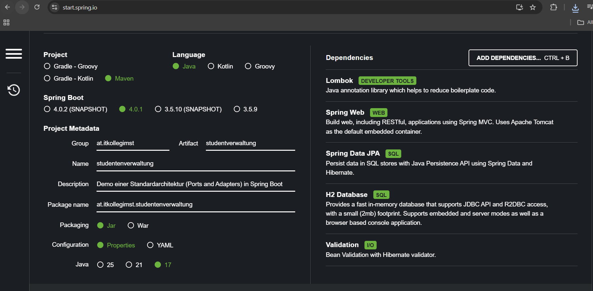

# Aufgabe 1 | 14.01.2026

## Video: A Intro
Neues Projekt erstellt mit Klassen und Interfaces sowie Paketen

## Video: B Domainlayer und Repository
Neues Paket wurde erstellt und mit Klassen und Interfaces

## Video: C Datenlayer
Wir haben @Component und @Autowirde benutzt. Wir haben eine neues Interface sowie Klassen erstellt.

## Video: D Servicelayer
Neues Packet namens Service wurde erstellt, mit einem Interface sowie einer Klasses.

## Video: E ControllerLayer

